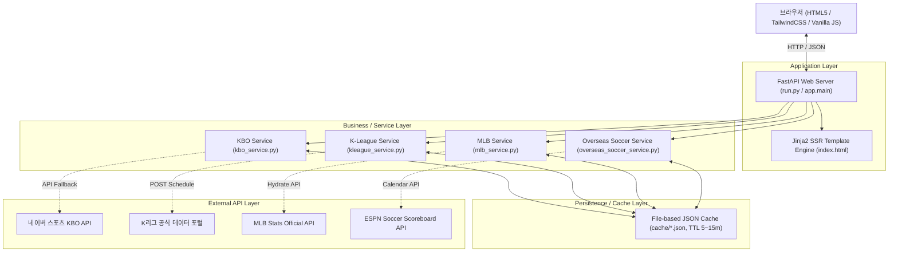
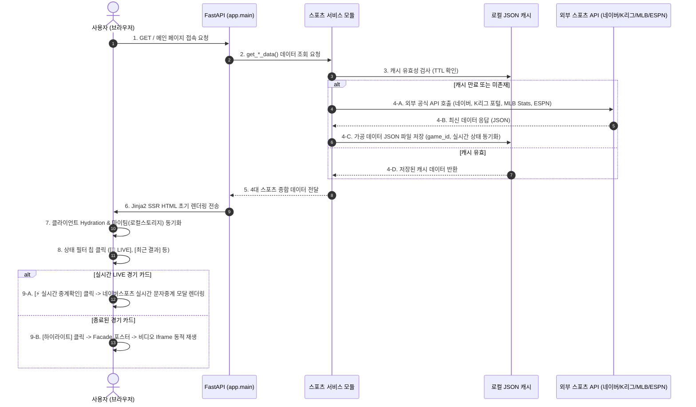

# 🏆 SPORTS HUB - 프로그램 명세서 및 시스템 설계서

> **버전**: v2.4.0  
> **작성일**: 2026-09-20  
> **저장소**: [https://github.com/th0501park-tech/master2](https://github.com/th0501park-tech/master2)  
> **산출물 파일**:
> - 📊 Excel 문서: [SPORTS_HUB_프로그램명세서_및_설계서.xlsx](file:///Users/소스/WEB_SPORTS/SPORTS_HUB_프로그램명세서_및_설계서.xlsx)
> - 📑 PowerPoint 프레젠테이션 (아키텍처 및 명세): [SPORTS_HUB_프로젝트_설계_및_명세서.pptx](file:///Users/소스/WEB_SPORTS/SPORTS_HUB_프로젝트_설계_및_명세서.pptx)
> - 📑 PowerPoint 프레젠테이션 (배포 및 운영 흐름도): [SPORTS_HUB_배포_및_운영_프로세스_흐름도.pptx](file:///Users/소스/WEB_SPORTS/SPORTS_HUB_배포_및_운영_프로세스_흐름도.pptx)

---

## 1. 프로젝트 개요

**SPORTS HUB**는 대한민국 4대 인기 스포츠(KBO 프로야구, K리그 1·2, 유럽 5대 축구리그, MLB 메이저리그)의 실시간 경기 스코어, 리그 순위, 선수 개인기록, 공식 하이라이트 영상 및 네이버스포츠 실시간 문자중계를 단일 웹 허브에서 통합 제공하는 올인원 대시보드 플랫폼입니다.

### 핵심 가치 및 특징
1. **상단 경기결과 / 하단 공식 영상 레이아웃**: 사이트 접속 시 실시간 경기 스코어와 오늘/내일 일정을 최상단에서 즉시 확인 가능.
2. **실시간(LIVE) 문자중계 모달 (`live-relay-modal`)**:
   - 경기가 실시간(LIVE)으로 진행 중일 경우 하단 `하이라이트` 버튼이 **`[⚡ 실시간 중계확인]`** 버튼으로 자동 전환.
   - 클릭 시 네이버스포츠 실시간 문자중계 페이지(`https://m.sports.naver.com/game/{game_id}/relay`)를 모달 팝업으로 직접 렌더링하여 볼카운트, 투구 추적, 이닝별 타석 결과를 페이지 이탈 없이 실시간 확인 가능.
   - 상단 [새 창으로 보기] 외부 링크 버튼 및 `ESC` 키/배경 클릭 닫기 지원.
3. **야구 (KBO / MLB)**: 실시간 이닝 및 마운드 투수 정보, 최근 경기 승·패·세이브 결정투수, 오늘/내일 선발투수 예고 지원.
4. **축구 (K리그 / 해외축구)**:
   - K리그 공식 API 상태코드(`1S`, `2S`, `HT`, `ET`, `PK`) 및 네이버 스포츠 실시간 축구 API(`kfootball`) 연동으로 실시간 LIVE 스코어, 전·후반 진행 분 정보, 네이버 `gameId` 매핑.
   - 해외축구 UTC 시간의 한국 표준시(KST, UTC+9) 자동 변환 표기.
5. **상태별 원클릭 필터 칩**: `[전체]`, `[🔴 LIVE]`, `[최근 결과]`, `[금주/내일 예정]` 원클릭 필터링.
6. **마이팀(선호 구단) 개인화**: 브라우저 로컬스토리지에 응원팀을 등록하여 최상단 우선 노출 및 골드 하이라이트.
7. **고성능 캐싱 & Facade 영상 지연 로딩**: 외부 API 호출 쿼터를 아끼고 초기 로딩 속도 0.5초 이내 유지.

---

## 2. 시스템 아키텍처 (4-Tier Layered Architecture)



---

## 3. 프로그램 모듈별 상세 명세서

| 모듈 경로 | 프로그램명 | 주요 함수 / 컴포넌트 | 기능 및 동작 설명 |
| :--- | :--- | :--- | :--- |
| `run.py` | 웹서버 엔트리포인트 | `main` | Uvicorn ASGI 서버 기동 (로컬 127.0.0.1:8000, 핫리로드) |
| `app/main.py` | FastAPI 컨트롤러 | `index_page`, `health_check` | 4대 스포츠 데이터 종합 로드 및 Jinja2 SSR 렌더링 |
| `app/services/kbo_service.py` | KBO 수집 엔진 | `get_kbo_data`, `fetch_kbo_recent_matches` | 실시간 이닝, 승·패전투수, 선발예고, 네이버 gameId 매핑, 10개 구단 순위 수집 |
| `app/services/kleague_service.py` | K리그 수집 엔진 | `get_kleague_data`, `fetch_kleague_recent_matches`, `fetch_naver_kfootball_map` | K리그 공식 상태코드(1S/2S/HT/ET/PK) 판별 및 네이버 kfootball 실시간 API 연동(gameId, 실시간 스코어/분 매핑) |
| `app/services/mlb_service.py` | MLB 수집 엔진 | `get_mlb_data`, `fetch_mlb_recent_matches` | 실시간 이닝, 승·패·세이브 투수, 선발예고, game_id 매핑, 30개 구단 순위 |
| `app/services/overseas_soccer_service.py` | 해외축구 수집 엔진 | `get_overseas_soccer_data`, `fetch_soccer_recent_matches` | 5대리그 순위, UTC->KST 시간 자동 변환, 전·후반 진행시간, 팀명 한글화 |
| `app/templates/index.html` | 메인 뷰 템플릿 | Jinja2 SSR 마크업 & 모달 | 상단 스코어보드 그리드, 실시간 중계확인 버튼 분기, live-relay-modal, 하단 영상 플레이어 |
| `app/static/js/main.js` | 클라이언트 SPA 스크립트 | `switchSport`, `setMatchFilter`, `openLiveRelayModal`, `closeLiveRelayModal` | 원클릭 상태 필터링, 마이팀 로컬스토리지 저장, 네이버스포츠 실시간 문자중계 모달 제어 |
| `app/static/css/style.css` | 스타일시트 | CSS Rules, Tailwind Helpers | 필터 칩 스타일, 라이브 펄스 애니메이션, 다크모드 대응 |

---

## 4. 프로세스 흐름도 (End-to-End Flow)



---

## 5. 외부 API 연동 명세

| 종목 | 제공 기관 | 엔드포인트 URL | 파라미터 규격 | 수집 데이터 |
| :--- | :--- | :--- | :--- | :--- |
| **KBO** | 네이버 스포츠 | `https://api-gw.sports.naver.com/schedule/games` | `fields=basic,baseball&fromDate,toDate&size=100&upperCategoryId=kbaseball` | 실시간 이닝, gameId, statusCode, 승·패전투수, 선발예고 |
| **MLB** | MLB Stats API | `https://statsapi.mlb.com/api/v1/schedule` | `sportId=1&startDate,endDate&hydrate=linescore,decisions,probablePitcher` | 실시간 이닝, game_pk, 승·패·세이브 결정투수, 선발투수 |
| **K리그** | K리그 포털 & 네이버 | `https://www.kleague.com/getScheduleList.do`<br>`https://api-gw.sports.naver.com/schedule/games` | `leagueId=1 or 2&year,month`<br>`upperCategoryId=kfootball` | K리그 공식 상태(1S/2S/HT/ET/PK), 네이버 실시간 스코어, 진행 분, gameId |
| **해외축구** | ESPN Soccer | `https://site.web.api.espn.com/apis/site/v2/sports/soccer/{code}/scoreboard` | `dates=YYYYMMDD` (캘린더 동적 연동) | KST 시간 변환, 실시간 스코어, displayClock(분), 금주/지난주 경기 |

---

## 6. 실행 및 배포 가이드

- **로컬 실행**:
  ```bash
  python run.py
  # 로컬 접속 주소: http://127.0.0.1:8000
  ```
- **클라우드 배포 (Render.com)**:
  - `Procfile`: `web: uvicorn app.main:app --host 0.0.0.0 --port $PORT`
  - `render.yaml`을 통한 자동 빌드 및 배포 지원.

---

## 7. 시스템 수정 및 보완 이력 (Changelog)

| 버전 | 일자 | 구분 | 대상 모듈 | 주요 수정 및 보완 내용 | 개선 효과 및 비고 |
| :--- | :--- | :--- | :--- | :--- | :--- |
| **v2.4.0** | 2026-09-20 | 긴급 버그수정 | `mlb_service.py`<br>`kbo_service.py`<br>`kleague_service.py`<br>`overseas_soccer_service.py` | **서버 타임존(Render UTC vs 로컬 KST) 불일치 캐시 프리징 해결 및 KST 표준화**<br>- `get_now_kst()` 공통 표준화로 호스팅 서버 타임존과 무관하게 한국 표준시 일치<br>- 캐시 타임스탬프 만료 검사 시 음수(`diff < 0`) 즉시 무효화 안전장치 탑재<br>- 커밋된 미래 타임스탬프 파일로 인해 서버 캐시가 갱신되지 않고 멈추던 버그 원천 해결 | Render 클라우드 배포 후 경기 스코어/상태가 수 시간 동안 멈추던 버그 완전 해결 |
| **v2.4.0** | 2026-09-20 | 기능 고도화 | `mlb_service.py`<br>`main.js` | **MLB 실시간 LIVE 경기 판정 정밀화 및 투수/타자 실시간 연동**<br>- MLB API `statusCode`(`O`, `F`, `CR`, `FR`) 및 `detailedState`(`Game Over`) 즉시 종료 처리<br>- 실시간 LIVE 이닝 포맷 한국어 정밀 매핑 (`8회초 1아웃`, `8회말` 등)<br>- 공식 linescore에서 현재 마운드 투수(`current_pitcher`) 및 타석 타자(`current_batter`) 실시간 추출하여 카드에 표출<br>- 종료 경기 노출 25개, 예정 경기 16개로 확대하여 당일 전 경기 및 내일 일정 완벽 커버<br>- LIVE 경기 25초, 비경기 시간대 90초 백그라운드 스마트 자동 폴링 적용 | 끝난 경기가 LIVE로 남는 현상 방지, 실시간 투수 vs 타자 매치업 카드 시각화, 당일 전 경기 스코어 열람 |
| **v2.3.0** | 2026-09-20 | 기능 개선 | `kbo_service.py`<br>`kleague_service.py`<br>`mlb_service.py`<br>`overseas_soccer_service.py` | **스마트 캐시 갱신 구조 도입 및 LIVE 경기 안전 판별 강화**<br>- 무거운 전체 크롤링은 TTL 캐시 유지하되, 라이브 경기 발생 시 25초 주기 실시간 fetch<br>- 경기 시작(KST) 기준 야구 5.5시간, 축구 3.5시간 초과 시 안전 종료 처리<br>- 클라이언트 30초 자동 폴링(`startLivePolling`) 지원 | 종료된 경기가 LIVE로 남아있던 버그 해결 및 실시간 새로고침 속도/정확도 개선 |
| **v2.3.0** | 2026-09-20 | 기능 개선 | `mlb_service.py`<br>`index.html` | **MLB 한국 표준시(KST) 변환 & 팀 식별자 및 네이버 연동 정상화**<br>- UTC 시간의 KST 9시간 자동 변환(`%m.%d(요일) HH:MM`) 표기<br>- 30개 구단 공식 Stats API ID 오타 전면 수정 및 구단명 정규화<br>- 네이버 해외야구(`wbaseball`) API 매핑(`fetch_naver_wbaseball_map`)으로 공식 gameId 확보 | MLB 경기 시간 가독성 향상 및 네이버 실시간 중계 gameId 완벽 매핑 |
| **v2.3.0** | 2026-09-20 | UI/UX 개선 | `main.js`<br>`index.html` | **실시간 중계 모달(`live-relay-modal`) UX 단독 팝업화 & 바로가기 강화**<br>- [실시간 중계확인] 클릭 시 새 창 동시 실행을 제거하고 **단독 팝업(모달)으로만** 깔끔하게 표출<br>- 팝업 상단에 초록색 [네이버 새 창 보기], 파란색 [MLB 3D게임데이] 바로가기 액션 버튼 배치<br>- 브라우저 iframe 보안 정책에 의한 로딩 멈춤 방지(1.5초 자동 페이드아웃) | 팝업/새 창 이중 실행 혼란 해결 및 편의성 극대화 |
| **v2.3.0** | 2026-09-20 | 버그 수정 | `index.html`<br>`base.html`<br>`overseas_soccer_service.py` | **브라우저 개발자도구 콘솔 오류 3종 완전 제거**<br>1) `iframe` 인라인 `onload` 제거 및 상단 방어 선언으로 `onRelayIframeLoaded is not defined` 해결<br>2) 해외축구 비디오 썸네일에서 비공개 `artwork.api.espn.com` API를 필터링하고 공개 CDN 이미지로 교체하여 `401 Unauthorized` 해결<br>3) Tailwind CDN 프로덕션 안내 콘솔 경고 필터링 적용<br>4) `main.js?v=...` 스크립트 캐시 버스팅 적용 | F12 개발자도구 콘솔 무결성 확보 및 안정성 향상 |
| **v2.2.0** | 2026-09-19 | 기능 추가 | `index.html`<br>`main.js` | **네이버스포츠 실시간 문자중계 모달(`live-relay-modal`) 최초 탑재**<br>- LIVE 경기 카드에 [실시간 중계확인] 버튼 노출 및 모달 연동 | 페이지 이탈 없는 실시간 문자중계 확인 |
| **v2.1.0** | 2026-09-19 | UI 개선 | `index.html`<br>`style.css` | **상단 경기결과 / 하단 영상 레이아웃 개편 및 상태 필터 칩 고도화** | 스코어보드 시인성 향상 |
| **v2.0.0** | 2026-09-19 | 아키텍처 | 전체 프로젝트 | **4대 스포츠 통합 올인원 대시보드 시스템 구축** | KBO, K리그, 해외축구, MLB 통합 |
